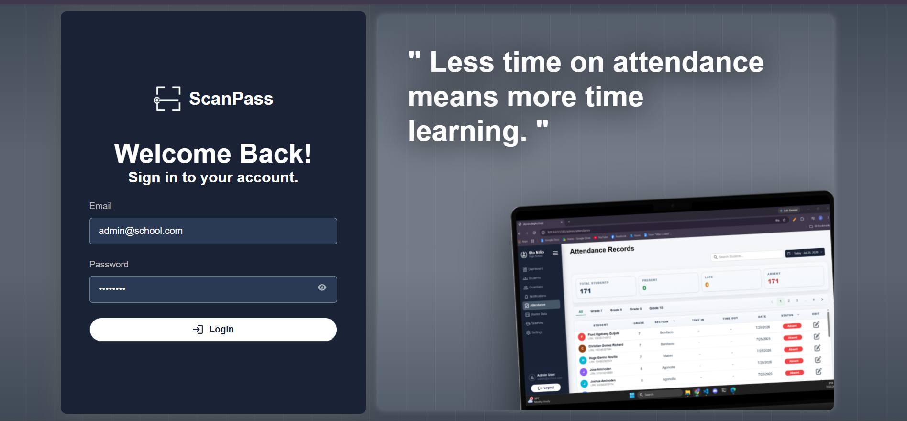
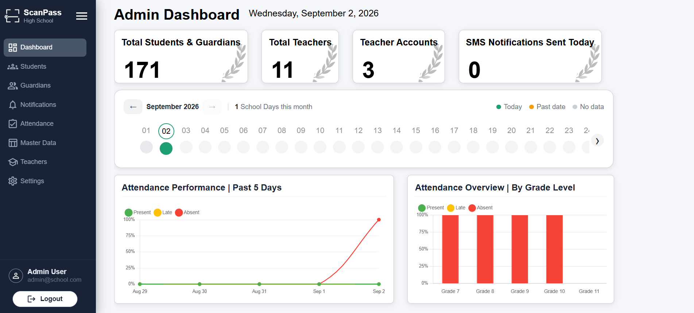
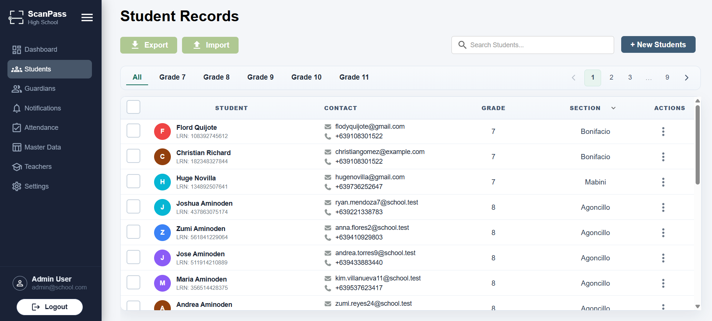
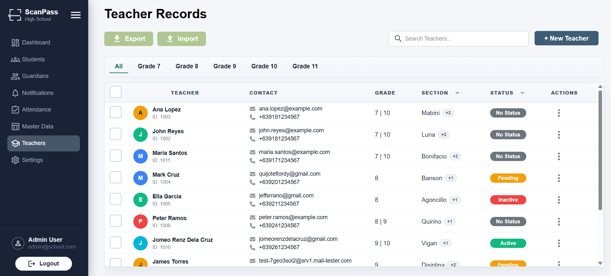
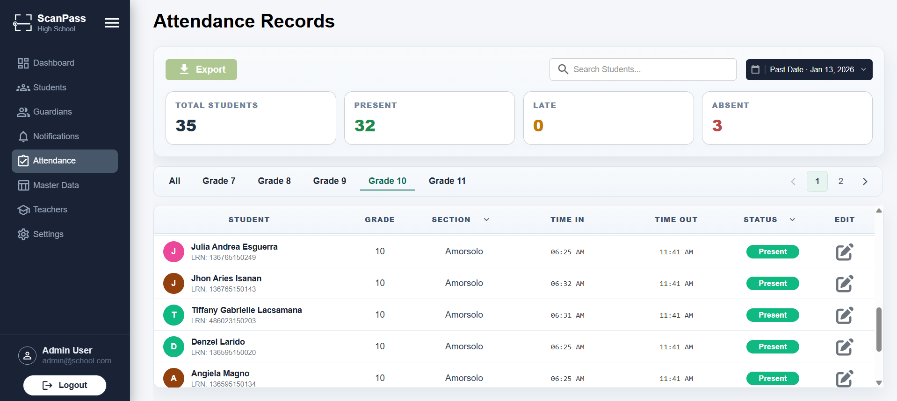
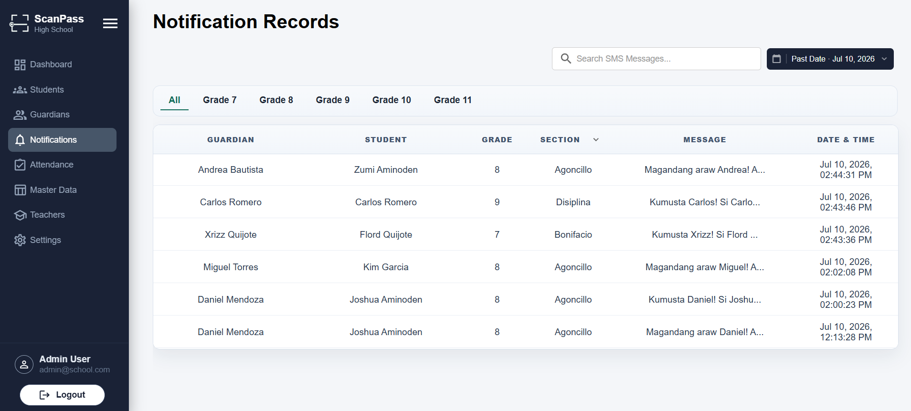

# ScanPass

ScanPass is a full-stack QR Code attendance management system built with React, Supabase, PostgreSQL, and React Native. It automates student attendance tracking, SMS notifications, and school data management through an intuitive web dashboard and mobile QR scanner.

ScanPass streamlines student attendance by replacing manual logging with QR code scanning while automatically notifying parents or guardians through SMS whenever a student checks in or checks out of the school.

---

## Overview

Traditional attendance systems are often time-consuming, prone to human error, and provide delayed communication with parents. They can also depend on hardware that is bulky or costly to maintain. ScanPass addresses these issues by providing::

- QR Code-based attendance

- Real-time check-in/check-out attendance logging

- SMS notifications to parents/guardians

- Student and faculty management

- Excel import for bulk data management

---

## Results & Recognition

- **Pilot test:** Deployed with 38 students over 3 days, achieving a **98.5% scan success rate** and reducing attendance recording time to seconds — down from the 5–10 minutes per period reported under the manual process it replaced.

- **Industry exposure:** Presented at **PLDT's MSME Day (Parañaque)**, pitching ScanPass to startup founders and industry professionals.

---

## Features

### Student Management

- Add, edit, archive, and restore students

- Generate QR Codes for student IDs once imported/added in the system

- Bulk import students through Excel

### Attendance Monitoring

- Real-time attendance logging

- Daily attendance records

- Attendance history

- Search and filter attendance

### QR Code Scanner

- Mobile application for scanning student IDs

- Instant attendance recording

- Fast QR code recognition

### Parent Notifications

- SMS notifications for:
  - Student Check-In

  - Student Check-Out

### Faculty Management

- Manage teacher accounts

- Role-based access control

- Account invitation via email

### Academic Management

- School Years

- Grades

- Sections

- Class Schedules

### Dashboard

- Attendance statistics

- Student statistics

- Faculty/Teachers statistics

- Data visualization

### Excel Import System

Supports bulk importing of:

- Students

- Faculty/Teachers

- Grades

- Sections

- Class Schedules

---

## Built With

### Frontend

- React

- Vite

- React Router

- CSS Modules

### Backend

- Supabase (PostgreSQL, Auth, Storage)

### Mobile

- React Native

- Expo

### Services

- Resend (Email)

- iProg SMS API

---

## Screenshots

| Page                       | Preview                                                        |
| -------------------------- | -------------------------------------------------------------- |
| Login Page                 |                     |
| Dashboard                  |                  |
| Student Management         |          |
| Faculty/Teacher Management |  |
| Attendance Logs            |           |
| SMS Notification           |                 |

---

## User Roles

### Admin

- Full system access

- Manage faculty

- Manage students

- Import data

- Generate QR Codes

- View attendance reports

### Teachers

- View attendance

- Manage assigned students

- Generate reports

### Scanner App

- Scan QR Codes

- Record attendance

- Trigger SMS notifications

---

## License

© 2025 Jomeo Renz A. Dela Cruz. All rights reserved.

This project is shared publicly for portfolio and academic review purposes. Please do not copy, redistribute, or reuse the code without permission.

---

## Developer

Developed by Jomeo Renz A. Dela Cruz.
